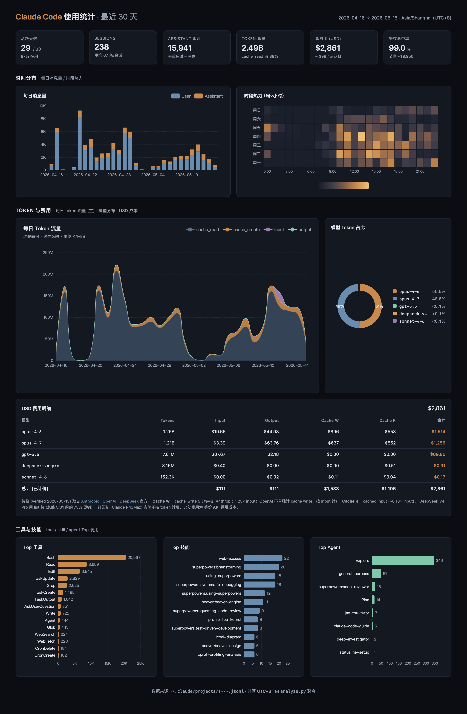

# cc-usage-stats

A Claude Code [Skill](https://docs.claude.com/en/docs/claude-code/skills) that builds a self-contained HTML dashboard summarizing your recent CC usage — tokens, USD cost, cache efficiency, and a top-N breakdown of which **tools / skills / subagents** you actually use.



> **UI is Chinese-only** (KPI labels, chart titles, cost notes are 简体中文). The CLI, `data.json`, and this README are English. PRs welcome for i18n.

## Why another CC usage tool?

There are already great CC usage trackers — [ccusage](https://github.com/ryoppippi/ccusage) (14k★), [Claude-Code-Usage-Monitor](https://github.com/Maciek-roboblog/Claude-Code-Usage-Monitor) (8k★), [phuryn/claude-usage](https://github.com/phuryn/claude-usage) (1.5k★), [nateherkai/token-dashboard](https://github.com/nateherkai/token-dashboard). This one is different in four specific ways:

| | cc-usage-stats | typical CC usage tool |
|---|---|---|
| **Form factor** | Claude Code Skill — invoke with `/cc-usage-stats` inside a CC session | npm CLI / npx / localhost server |
| **Output** | **One static HTML file**, opens via `file://`, double-click works | Live server on `localhost:xxxx`, requires Node/Python runtime kept alive |
| **Skill / subagent attribution** | Top **skills** and **subagents** by invocation count (the thing [anthropics/claude-code#35319](https://github.com/anthropics/claude-code/issues/35319) is asking for) | Most stop at tool-name aggregation |
| **Multi-provider pricing** | Anthropic + OpenAI + DeepSeek per-model rates, with cache-write / cache-read columns | Usually Anthropic-only |

### Trade-offs (be honest)

- **No real-time monitoring.** This is a snapshot tool — run it when you want a report, not a live dashboard. If you want the latter, use [Claude-Code-Usage-Monitor](https://github.com/Maciek-roboblog/Claude-Code-Usage-Monitor) or [phuryn/claude-usage](https://github.com/phuryn/claude-usage).
- **Cost is API-equivalent**, not your actual bill. Pro/Max subscribers don't pay per-token; the USD figure shows what the same usage *would* cost via the API.
- **Pricing table is static** — refreshed manually. The skill warns when prices are >7 days old and will refresh from official pricing pages.

## Install

This skill lives inside the [mirope-cc-skills](https://github.com/MokusMokun/mirope-cc-skills) monorepo. Clone the repo, then either copy or symlink just this skill into your CC skills directory:

```bash
# One-shot copy
git clone https://github.com/MokusMokun/mirope-cc-skills.git /tmp/mirope-cc-skills
cp -r /tmp/mirope-cc-skills/skills/cc-usage-stats ~/.claude/skills/

# Or symlink for `git pull` updates
git clone https://github.com/MokusMokun/mirope-cc-skills.git ~/code/mirope-cc-skills
ln -s ~/code/mirope-cc-skills/skills/cc-usage-stats ~/.claude/skills/cc-usage-stats
```

That's it. No `npm install`, no `pip install` — the script uses only Python stdlib (3.9+), and the dashboard pulls ECharts from a CDN at render time.

## Usage

### Inside Claude Code

```
/cc-usage-stats
```

The skill defaults to a 30-day window ending today and writes to `./_cc-usage-report/<YYYYMMDD>/`. You can ask for custom windows in plain language:

- "summarize my CC usage for the last 7 days"
- "build a CC dashboard ending 2026-05-01"

### Standalone (no Claude Code)

```bash
python3 ~/.claude/skills/cc-usage-stats/scripts/analyze.py \
  --out ./_cc-usage-report/$(date +%Y%m%d)/

# Custom window
python3 ~/.claude/skills/cc-usage-stats/scripts/analyze.py \
  --out ./report/ --end 2026-05-15 --days 30
```

Then open `./_cc-usage-report/<date>/index.html` in any browser.

## What's in the dashboard

| Section | Contents |
|---|---|
| **KPI strip** | active days, sessions, assistant messages, total tokens, **total USD cost**, cache hit rate |
| **时间分布** | daily user/assistant message bar chart + weekday × hour heatmap |
| **Token 与费用** | hero stacked-area chart (input/output/cache_read/cache_write per day) + model donut + USD cost table broken down by provider × column |
| **工具与技能** | Top tools, Top skills (by `subagent_type` and `Skill` invocation), Top agents |

## How it works

1. Walks `~/.claude/projects/**/*.jsonl` (the per-session transcripts CC writes locally).
2. Deduplicates by `message.id`, reads `usage.input_tokens` / `output_tokens` / `cache_creation_input_tokens` / `cache_read_input_tokens` per assistant message.
3. Counts `tool_use` blocks for tools/skills/subagents (`Skill`, `Task` with `subagent_type`).
4. Applies per-model pricing (input × $/MTok + output × $/MTok + cache_create × 1.25× input + cache_read × 0.10× input for Anthropic).
5. Inlines the result into a single HTML file with ECharts.

Nothing leaves your machine. The only network call is the dashboard fetching ECharts from `cdn.jsdelivr.net` when you open it in a browser.

## Refreshing the pricing table

Rates live in `scripts/analyze.py` as `PRICING_USD_PER_MTOK`, with a `PRICING_DATE` constant. The skill auto-prompts to refresh when prices are >7 days old. Sources:

- [Anthropic pricing](https://platform.claude.com/docs/en/about-claude/pricing)
- [OpenAI pricing](https://openai.com/api/pricing/)
- [DeepSeek pricing](https://api-docs.deepseek.com/quick_start/pricing/)

## Files

```
cc-usage-stats/
├── SKILL.md                    # CC skill manifest + workflow checklist
├── README.md                   # this file
├── LICENSE                     # MIT
├── screenshot.png              # dashboard preview
└── scripts/
    ├── analyze.py              # CLI: reads jsonl, writes data.json + index.html
    └── index.html.template     # ECharts dashboard with __DATA_PLACEHOLDER__
```

## License

[MIT](./LICENSE)
